# Multifunction Instrumentation System (M.I.S.)

**Developed by Nikhil Mahadevan**

A portable, Raspberry Pi–powered electronic test bench that replaces six lab instruments — ohmmeter, voltmeter, DC reference, square/sine function generator, and frequency meter — with one integrated DAQ platform.

[](https://www.raspberrypi.com/)
[](https://www.python.org/)
[](https://www.kicad.org/)

---

## Overview

The Multifunction Instrumentation System integrates the capabilities of traditional laboratory hardware — oscilloscopes, function generators, and multimeters — into a single-board computer platform using the **Raspberry Pi 4** as the central processing unit. Custom analog front-end circuits handle signal conditioning, comparison, and generation; Python firmware orchestrates measurement, waveform output, and a responsive menu-driven UI from a single application.

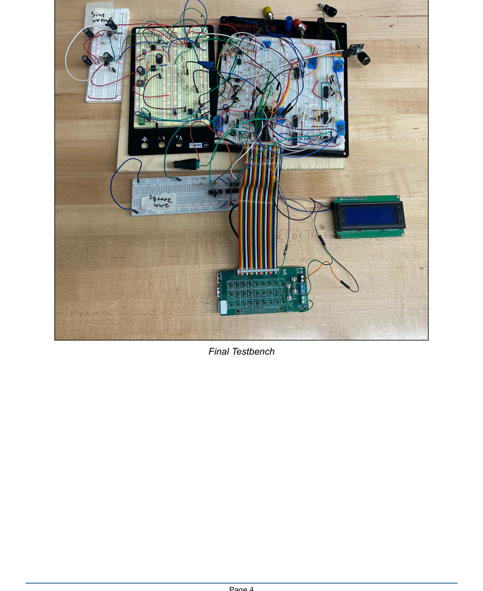

### At a Glance

| | |
|---|---|
| **Controller** | Raspberry Pi 4 (sole processor — no external MCU) |
| **Interface** | 20×4 I²C LCD + KY-040 rotary encoder with pushbutton |
| **Analog front-end** | TL084/TL081 op-amps, LM339 comparators, MCP4131/MCP4231 digipots |
| **Power** | 24 V DC input → ±12 V virtual-ground split-rail supply |
| **Firmware** | ~970 lines of Python — SAR measurement, hardware PWM, pigpio edge detection |
| **PCB** | 4-layer KiCad hierarchical design with Gerber manufacturing files |

### Project Objectives

1. **Instrument design**
   - Ohmmeter (500 Ω – 10 kΩ)
   - Voltmeter (−5 V to +5 V)
   - DC reference (−5 V to +5 V)
   - Sine wave frequency measurement (1 – 10 kHz)
   - Function generator — square wave (100 Hz – 10 kHz, ±10 V) and sine wave (1 – 10 kHz, 0 – 10 V pk)

2. **System integration**
   - ±12 V power supply from 24 V input
   - Software-driven successive-approximation measurement (digipot + comparator)
   - Rotary-encoder UI on 20×4 LCD

3. **PCB layout**
   - Full KiCad schematic and 4-layer board design sized to the Raspberry Pi footprint

### Design Constraints

| Category | Constraint |
|---|---|
| **Software** | All logic in Python; pigpio daemon for timing-critical PWM and edge detection |
| **Controller** | Raspberry Pi 4 only — no external microcontrollers |
| **Digipots** | Maximum of 4 digital potentiometers (MCP4131 ×3, MCP4231 ×1 dual-channel) |
| **Power** | All analog power derived from 24 V DC (LCD powered separately); Pi via USB-C |
| **Mechanical** | Pi Hat required — all GPIO routed through hat connector |

---

## Instrument Summary

| Instrument | Range | Accuracy | Update Rate |
|---|---|---|---|
| Ohmmeter | 500 Ω – 10 kΩ | ±10% | 500 ms |
| Voltmeter | −5 V to +5 V | ±0.2 V | 500 ms |
| DC Reference | −5.00 V to +4.80 V (32 steps) | ±0.2 V | On demand |
| Square Wave | 100 Hz – 10 kHz, ±10 V pk | ±1 V amplitude | Real-time PWM |
| Sine Wave | 1 – 10 kHz, 0 – 10 V pk | ±0.2 V amplitude | Real-time audio |
| Frequency Meter | 1 – 10 kHz | ±1% | 500 ms |

---

## Software Architecture

Software is the core of the system — it links the user interface to hardware modules, converts raw comparator signals into resistance/voltage values, controls waveform timing, and keeps the LCD updated. The rotary encoder dynamically switches between instruments while shared GPIO resources are managed safely.

### Platform & Libraries

| Layer | Technology |
|---|---|
| OS | Raspberry Pi OS |
| Execution | Standalone Python script (`Main Code/16.py`) |
| GPIO / PWM | `RPi.GPIO`, `pigpio` (hardware PWM + µs edge timestamps) |
| SPI | `spidev` — MCP4131 / MCP4231 digital potentiometers |
| I²C | `smbus2`, `RPLCD` — 20×4 character LCD |
| UI input | `gpiozero` — rotary encoder + button callbacks |

### Navigation & State Machine

The interface is a **stack-based menu tree** implemented as a Python dictionary mapping screen states to selectable options. A history stack allows forward navigation into submenus and backward navigation via a 3-second button hold. All hardware outputs disable automatically when navigating back or returning to the main screen.

**Menu hierarchy:** Main → Mode Select → {Function Generator, Ohmmeter, Voltmeter, DC Reference, Frequency Measurement} → instrument-specific submenus.

### Main Control Loop

The main loop checks `current_menu` to determine which instrument logic runs. Measurement modes sample every **500 ms**. Rotary encoder and button use **asynchronous callbacks** (`when_rotated`, `when_released`) so input is detected instantly without blocking measurements. The LCD refreshes only when `display_needs_update` is set (polled every 50 ms), reducing CPU overhead and flicker. All LCD writes are protected by a threading lock.

```
while True:
    if display_needs_update → render_interface()
    if measurement_mode     → sample hardware every 500 ms
    if leaving_mode         → cleanup GPIO / stop waveforms
    sleep(0.05)
```

### Per-Instrument Firmware

**Function Generator**
- *Square:* Hardware PWM on GPIO 12 at 50% duty via pigpio. Amplitude and DC offset controlled by MCP4231 over SPI. Frequency: 100 Hz – 10 kHz (10 Hz slow / 100 Hz fast steps).
- *Sine:* Pi 3.5 mm audio jack driven by `speaker-test` subprocess. Amplitude via MCP4131 (CS GPIO 17) with calibrated lookup table. Frequency: 1 – 10 kHz in 500 Hz steps.

**Ohmmeter**
- 8-iteration binary search across 128 MCP4131 wiper positions; LM339 output on GPIO 21.
- `R_unknown = R_known × (step / (128 − step))` with R_known = 10 kΩ.

**Voltmeter**
- Same SAR approach; comparator on GPIO 6. Converged tap mapped via calibrated lookup table (−4.95 V to +5.00 V) with linear interpolation.
- *External mode:* reads input terminals directly.
- *Internal Ref mode:* enables DC reference, 40 ms settling delay, then self-verifies output.

**DC Reference**
- 5-bit index written to GPIO 14, 15, 18, 23, 24 driving R-2R ladder. Index 0–31 → −5.00 V to +4.80 V in ~0.625 V steps.

**Frequency Measurement**
- pigpio rising-edge callbacks on GPIO 25 with µs timestamps. Rolling 100-period buffer; outliers >2σ discarded; f = 1 / mean(period).

---

## Hardware Design

### 4.1 ±12 V Power Supply

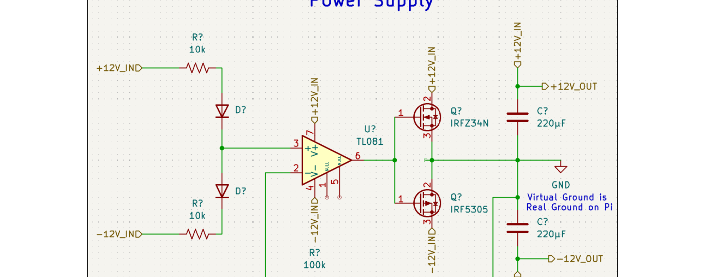

**Objective:** Split a +24 V DC input into symmetric +12 V and −12 V rails to power op-amps throughout the system. Rails must remain stable under varying load.

**Theory of Operation:** The supply uses a **virtual ground** approach. A TL081 unity-gain follower has its non-inverting input set to the 12 V midpoint of the 24 V supply via a matched resistive divider. The op-amp output drives a complementary push-pull stage (IRFZ34N NMOS + IRF5305 PMOS) that sources and sinks current symmetrically, establishing a stable virtual ground node tied to the Raspberry Pi's real ground. Connected circuits see +12 V above and −12 V below this reference.

1. **Voltage reference:** +24 V divided across two matched 10 kΩ resistors with Zener clamping diodes, presenting 12 V to TL081 pin 3.
2. **Unity-gain buffering:** TL081 follower with 100 kΩ feedback drives both MOSFET gates at high input impedance.
3. **Push-pull output:** NMOS sources positive load current; PMOS sinks negative load current from the virtual ground node.
4. **Output stabilization:** 220 µF bulk capacitors on each rail suppress transients and ripple.

**Physical Integration:** Implemented on breadboard. +24 V input through divider/Zener clamp; TL081 powered from +24 V/GND; MOSFET sources joined at virtual ground (also Pi GND); ±12 V distributed via terminal blocks.

**GPIO:** None — purely analog hardware. Virtual ground tied to Pi GND for a unified reference.

**Calibration & Testing:**
- Both rails loaded: −12.04 V / +12.05 V at ~12 mA each
- No load: −12.05 V / +12.06 V
- Asymmetric load: each rail stable independently at ~12.05–12.06 V, ~12 mA
- 250 Ω equivalent load (three 750 Ω in parallel): 48 mA total, 0.192 W per resistor (within 0.5 W rating and 2× safety margin)
- Design change: 200 µF ceramic → 220 µF electrolytic for better bulk capacitance under switching loads

**Usage Notes:**
- MOSFETs run warm under heavy load — allow cooling time
- Observe electrolytic capacitor polarity on each rail

---

### 4.2 Ohmmeter

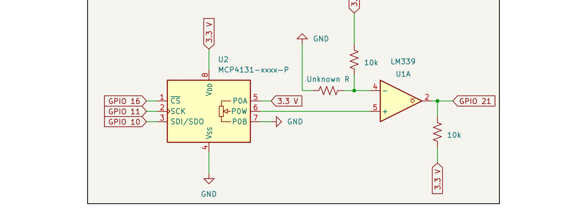

**Objective:** High-accuracy auto-ranging digital ohmmeter for **500 Ω to 10 kΩ**.

**Theory of Operation:** A voltage divider pairs the unknown resistor with a **7-bit MCP4131 digital potentiometer** as a programmable reference. Software sweeps 128 wiper steps using successive approximation; the LM339 comparator signals when the reference matches the divider junction voltage. A continuous 500 ms sampling loop updates the LCD with live readings and ±10% tolerance.

**Physical Integration:** MCP4131 on SPI (CS GPIO 8, SCK GPIO 11, MOSI GPIO 10). LM339 on 3.3 V with 10 kΩ open-collector pull-up. Unknown resistance connected via terminal block.

**GPIO Wiring:**

| Signal | GPIO | Component Pin |
|---|---|---|
| Chip Select (CS) | 8 | MCP4131 Pin 1 |
| SPI Clock (SCK) | 11 | MCP4131 Pin 2 |
| SPI Data (SDI/SDO) | 10 | MCP4131 Pin 3 |
| Comparator Output | 21 | LM339 Output |

The MCP4131 wiper feeds the LM339 non-inverting input. The unknown resistor forms a divider with a 10 kΩ pull-up to 3.3 V at the inverting input. GPIO 21 reads the comparator for binary search convergence.

**Calibration & Testing:**
- **545.2 Ω** — accurate live reading ([demo video](https://youtube.com/shorts/uuvFe1sM46w))
- **5.34 kΩ** — consistent within tolerance ([demo video](https://youtube.com/shorts/DNIFMVdOc38))
- **10.06 kΩ** — reliable at upper range ([demo video](https://youtube.com/shorts/9y2mZVJNhto))
- Consistent small error offset observed, but reliable across full 500 Ω – 10 kΩ range

---

### 4.3 Voltmeter

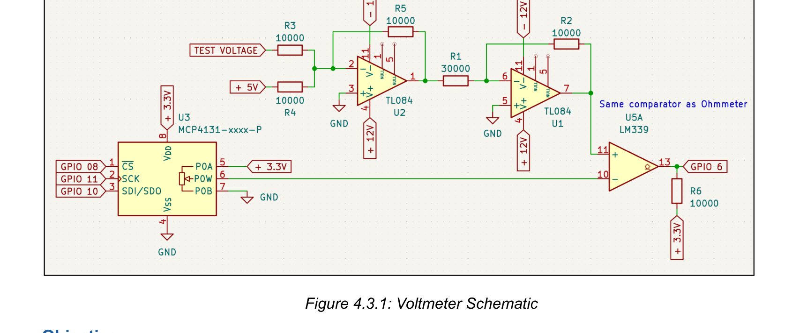

**Objective:** Measure external and internal DC voltages from **−5 V to +5 V** with ±0.2 V accuracy. Supports dual-source operation (external input or internal DC reference verification).

**Theory of Operation:**

1. **Inverting summing amplifier (U2):** External test voltage enters via 10 kΩ (R3), summed with +5 V reference (R4). Inverting gain maps −5 V to +5 V input → 0 V to −10 V at TL084 pin 1.
2. **Inverting amplifier (U1):** 30 kΩ / 10 kΩ gives gain −1/3, scaling 0 V to −10 V → **0 to +3.3 V** for safe logic-level comparison.
3. **Programmable reference (U3 — MCP4131):** Configured as 3.3 V voltage divider; 128 wiper steps via SPI (GPIO 8, 11, 10).
4. **Comparison (U5A — LM339):** Scaled signal on non-inverting input (pin 11); digipot wiper on inverting input (pin 10). Open-collector output pulled up to 3.3 V via 10 kΩ (R6) at pin 13.
5. **Digital feedback (GPIO 6):** High = test voltage above reference; software binary-searches the wiper until they match.

**Physical Integration:** TL084 stages on ±12 V rails; MCP4131 and LM339 on 3.3 V. LM339 shared with ohmmeter — software mode selection prevents conflicts.

**GPIO Wiring:**

| Signal | GPIO | Component Pin |
|---|---|---|
| Chip Select (CS) | 8 | MCP4131 Pin 1 |
| SPI Clock (SCK) | 11 | MCP4131 Pin 2 |
| SPI Data (SDI/SDO) | 10 | MCP4131 Pin 3 |
| Comparator Output | 6 | LM339 Pin 13 |

**Calibration & Testing:** LCD readouts verified against a reference multimeter across the full range using the characterization table below. SAR converges in 8 iterations. One-minute stability test at fixed input confirmed no flicker at 500 ms intervals. ±0.2 V accuracy maintained; best precision near 0 V; slight offset at range extremes from input protection drop.

<details>
<summary><strong>Voltmeter calibration table (input voltage → digipot step)</strong></summary>

| Voltmeter Value (V) | Digipot Step |
|---:|---:|
| −4.95 | 0 |
| −4.80 | 1 |
| −4.70 | 3 |
| −4.60 | 4 |
| −4.50 | 5 |
| −4.40 | 7 |
| −4.30 | 8 |
| −4.20 | 9 |
| −4.10 | 10 |
| −4.00 | 12 |
| −3.90 | 13 |
| −3.80 | 14 |
| −3.70 | 15 |
| −3.60 | 17 |
| −3.50 | 18 |
| −3.40 | 19 |
| −3.30 | 20 |
| −3.20 | 22 |
| −3.10 | 23 |
| −3.00 | 25 |
| −2.90 | 26 |
| −2.80 | 27 |
| −2.70 | 28 |
| −2.60 | 29 |
| −2.50 | 31 |
| −2.40 | 32 |
| −2.30 | 33 |
| −2.20 | 34 |
| −2.10 | 36 |
| −2.00 | 37 |
| −1.90 | 39 |
| −1.80 | 40 |
| −1.70 | 41 |
| −1.60 | 42 |
| −1.50 | 43 |
| −1.40 | 45 |
| −1.30 | 46 |
| −1.20 | 47 |
| −1.10 | 49 |
| −1.00 | 50 |
| −0.90 | 51 |
| −0.80 | 52 |
| −0.70 | 54 |
| −0.60 | 55 |
| −0.50 | 56 |
| −0.40 | 57 |
| −0.30 | 58 |
| −0.20 | 60 |
| −0.10 | 61 |
| +0.00 | 62 |
| +0.10 | 64 |
| +0.20 | 65 |
| +0.30 | 66 |
| +0.40 | 67 |
| +0.50 | 68 |
| +0.60 | 70 |
| +0.70 | 71 |
| +0.80 | 72 |
| +0.90 | 74 |
| +1.00 | 75 |
| +1.10 | 76 |
| +1.20 | 77 |
| +1.30 | 79 |
| +1.40 | 80 |
| +1.50 | 81 |
| +1.60 | 82 |
| +1.70 | 84 |
| +1.80 | 85 |
| +1.90 | 86 |
| +2.00 | 87 |
| +2.10 | 89 |
| +2.20 | 90 |
| +2.30 | 92 |
| +2.40 | 93 |
| +2.50 | 94 |
| +2.60 | 95 |
| +2.70 | 96 |
| +2.80 | 98 |
| +2.90 | 99 |
| +3.00 | 100 |
| +3.10 | 101 |
| +3.20 | 103 |
| +3.30 | 104 |
| +3.40 | 105 |
| +3.50 | 106 |
| +3.60 | 108 |
| +3.70 | 109 |
| +3.80 | 110 |
| +3.90 | 112 |
| +4.00 | 113 |
| +4.10 | 114 |
| +4.20 | 116 |
| +4.30 | 117 |
| +4.40 | 118 |
| +4.50 | 119 |
| +4.60 | 120 |
| +4.70 | 122 |
| +4.80 | 123 |
| +4.90 | 124 |
| +5.00 | 125 |

</details>

---

### 4.4 DC Reference

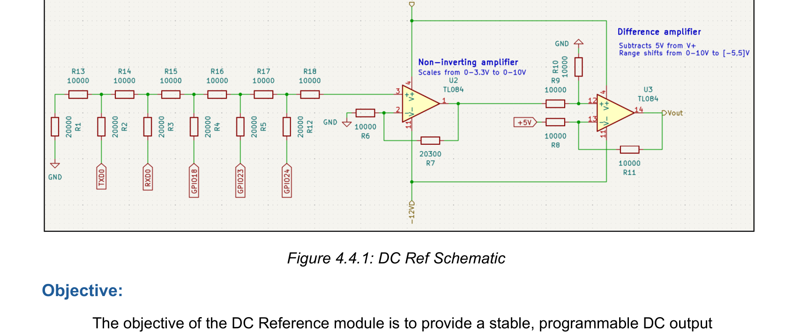

**Objective:** Stable, programmable DC output from **−5 V to +5 V** in 0.625 V steps (32 levels), adjustable via rotary encoder. Used to calibrate the voltmeter and as an external reference source.

**Theory of Operation:**

1. **R-2R DAC network:** Five GPIO lines (14, 15, 18, 23, 24) each drive a 10 kΩ series resistor in parallel with a 20 kΩ pull-down to GND, forming a binary-weighted divider. 5-bit codes produce ~0.206 V steps before amplification.
2. **Non-inverting amplifier (U2 — TL084):** R6 = 10 kΩ, R7 = 20.3 kΩ → gain ≈ 3.03, scaling 0–3.3 V DAC to 0–10 V.
3. **Difference amplifier (U3 — TL084):** +5 V bias shifts 0–10 V down by 5 V, yielding **−5 V to +5 V** output in 0.625 V increments.

**Physical Integration:** GPIO lines through 10 kΩ resistors to summing node; U2/U3 on ±12 V rails; Vout at terminal block (high-impedance, minimal load current).

**Previous Design Iteration:**

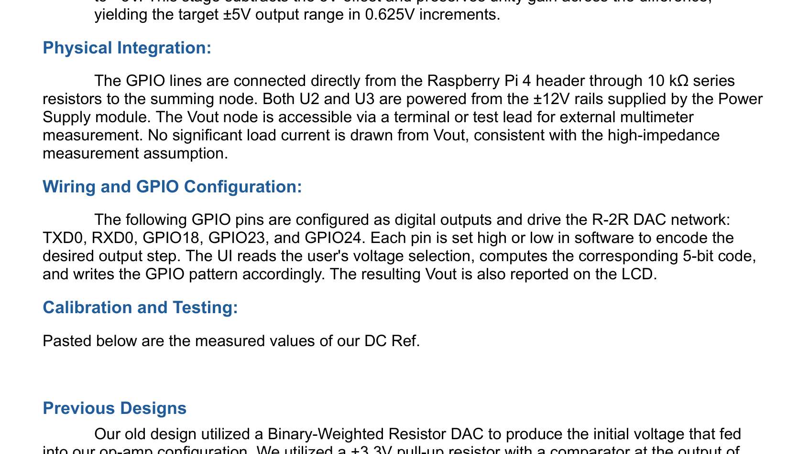

An earlier binary-weighted resistor DAC with comparator buffers on each GPIO line suffered from **cross-loading** — changing one bit altered the impedance seen by all others, producing incorrect voltages even when pins were off. The R-2R ladder maintains uniform 2R impedance in both directions regardless of bit pattern, eliminating this issue.

**Calibration & Testing:**

<details>
<summary><strong>DC reference measured output table (step → voltage)</strong></summary>

| Step | Binary Value | Measured Vout (V) |
|---:|---|---:|
| 0 | 0 | −5.035 |
| 1 | 1 | −4.670 |
| 2 | 10 | −4.369 |
| 3 | 11 | −4.000 |
| 4 | 100 | −3.732 |
| 5 | 101 | −3.368 |
| 6 | 110 | −3.068 |
| 7 | 111 | −2.706 |
| 8 | 1000 | −2.450 |
| 9 | 1001 | −2.086 |
| 10 | 1010 | −1.785 |
| 11 | 1011 | −1.422 |
| 12 | 1100 | −1.149 |
| 13 | 1101 | −0.786 |
| 14 | 1110 | −0.485 |
| 15 | 1111 | −0.123 |
| 16 | 10000 | +0.103 |
| 17 | 10001 | +0.466 |
| 18 | 10010 | +0.767 |
| 19 | 10011 | +1.129 |
| 20 | 10100 | +1.404 |
| 21 | 10101 | +1.765 |
| 22 | 10110 | +2.066 |
| 23 | 10111 | +2.429 |
| 24 | 11000 | +2.685 |
| 25 | 11001 | +3.048 |
| 26 | 11010 | +3.349 |
| 27 | 11011 | +3.711 |
| 28 | 11100 | +3.985 |
| 29 | 11101 | +4.346 |
| 30 | 11110 | +4.647 |
| 31 | 11111 | +5.008 |

</details>

---

### 4.5 Square Wave Generator

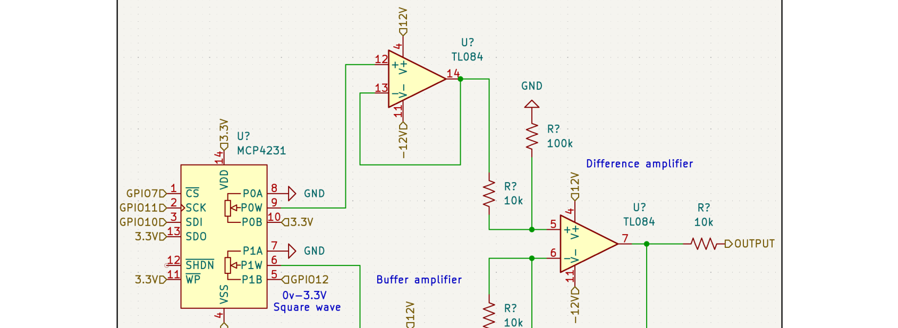

**Objective:** Variable-frequency, variable-amplitude square wave centered at **0 V** with up to **±10 V** swing and high output impedance for oscilloscope measurement.

**Theory of Operation:** Raspberry Pi hardware PWM on GPIO 12 produces 0–3.3 V at 50% duty. Signal passes through MCP4231 digipot + buffer for variable amplitude, then a difference amplifier subtracts a variable DC offset (second digipot channel, 3.3 V derived) to center at 0 V. Gain of 10 scales to ±10 V.

**Physical Integration:** TL084 quad op-amp, MCP4231 dual digipot, three 10 kΩ and two 100 kΩ resistors. Pi PWM → digipot Ch1 pin B; 3.3 V → Ch2 for offset. Buffer amplifiers on both difference-amp inputs; 10 kΩ output resistor for high-Z.

**GPIO Wiring:**

| Signal | GPIO | MCP4231 Pin |
|---|---|---|
| PWM Output | 12 | Ch1 Pin B |
| Chip Select | 7 | Pin 1 |
| SPI Clock | 11 | Pin 3 |
| SPI Data In | 10 | Pin 4 |

**Calibration & Testing:** [Demo video](https://youtube.com/shorts/NfCk3m-b2u8)

- Initial 0.5 wiper offset ratio: −7.24 V / +5.95 V (miscentered)
- Final offset ratio **0.45** (below ideal 0.5 due to MCP4231 channel variation) → ±3% centering tolerance
- Buffer amplifiers significantly reduced noise and improved waveform cleanliness

<p align="center">
  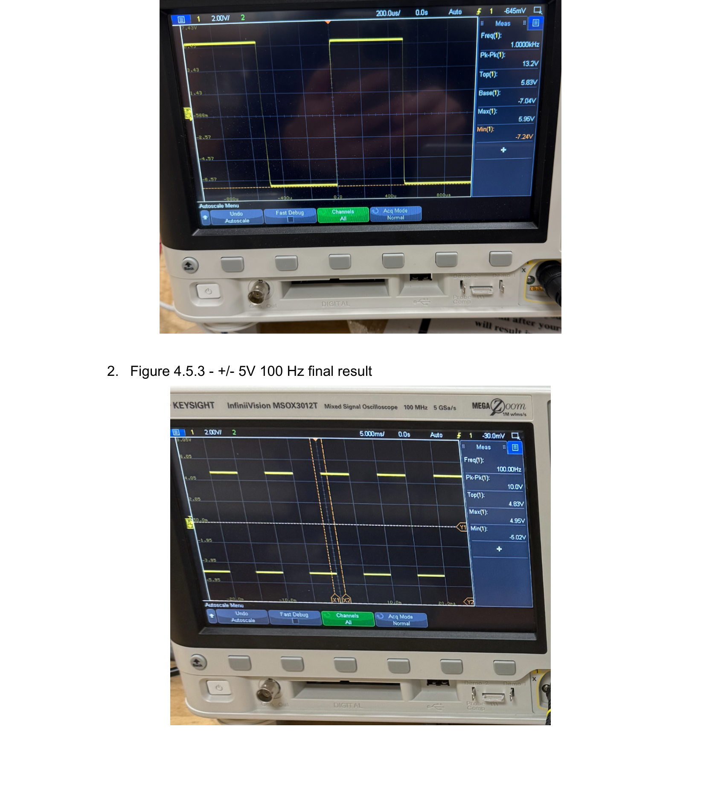
  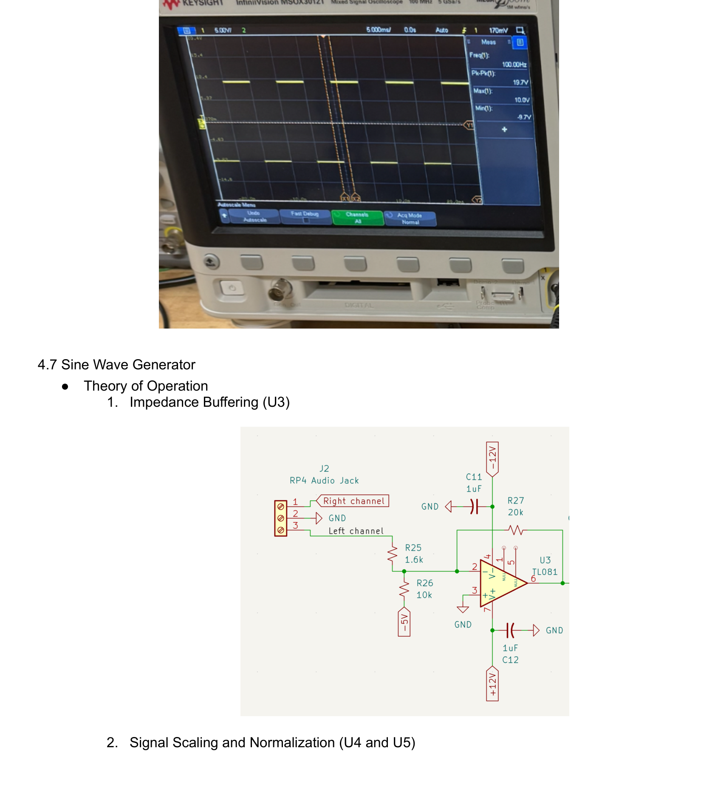
</p>

---

### 4.6 Sine Wave Measurement (Frequency Meter)

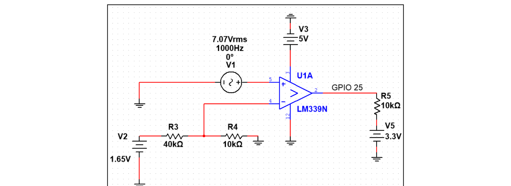

**Objective:** Measure frequency of an external **0 V to +10 V** sine input from **1 kHz to 10 kHz**.

**Theory of Operation:** LM339 comparator converts the sine to a digital square wave — output goes high when input exceeds a fixed **+1.65 V** threshold. GPIO 25 detects rising edges; elapsed time between edges = period; **f = 1/T**. 10 kΩ pull-up to 3.3 V on open-collector output.

**Physical Integration:** LM339 on +12 V/GND; external sine via banana plug to non-inverting input; inverting input held at +1.65 V from buffered divider; output to GPIO 25.

**GPIO Wiring:**

| Signal | GPIO | Component Pin |
|---|---|---|
| Comparator Output | 25 | LM339 Output |
| External Input | — | LM339 Non-Inverting Input |
| Reference (+1.65 V) | — | LM339 Inverting Input |

**Calibration & Testing:** [Demo video](https://youtube.com/shorts/Z5qWBG-sBkY)

- Tested 1 – 10 kHz at multiple amplitudes; **±2% tolerance**
- +1.65 V threshold is minimum reliable reference — peaks below this are not detected
- Alternative AC-coupling + Schmitt trigger design rejected for simplicity
- Software retains 100 periods, discards >2σ outliers, averages remainder; pigpio provides µs edge timing

---

### 4.7 Sine Wave Generator

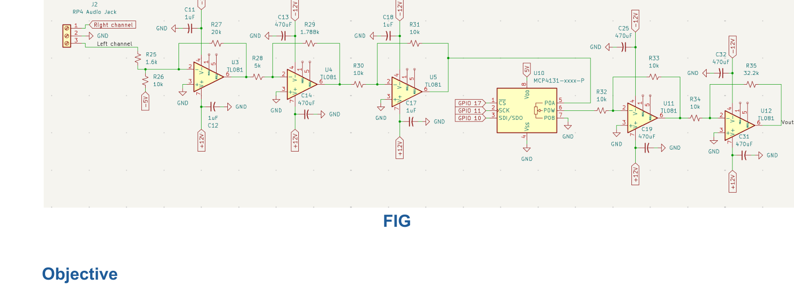

**Objective:** Generate **0 – 10 V peak** sine wave (base at 0 V) from **1 kHz to 10 kHz**.

**Theory of Operation:**

1. **Impedance buffering (U3 — TL081):** Pi audio jack left channel → voltage follower with −5 V DC offset to eliminate frequency-dependent loading/sag.
2. **Scaling (U4 & U5):** U4 inverts/scales 10 V range → −3.3 V to 0 V; U5 unity inverts → clean 0–3.3 V.
3. **Digital attenuation (U10 — MCP4131):** Pin A at 0–3.3 V, Pin B to GND; wiper amplitude control via SPI (GPIO 17, 11, 10).
4. **Output reconstruction (U11 & U12):** U11 buffer → U12 inverting gain −3.03 → 0–10 V Vout.

**Physical Integration:** Breadboard chain from stripped 3.5 mm audio jack through TL081 stages and MCP4131. 470 µF bulk + 1 µF bypass caps at each op-amp supply pin. Powered from ±12 V and −5 V offset rail.

**GPIO Wiring:**

| Signal | GPIO | MCP4131 Pin |
|---|---|---|
| Chip Select | 17 | Pin 1 |
| SPI Clock | 11 | Pin 2 |
| SPI Data | 10 | Pin 3 |

**Calibration & Testing:** [Demo video](https://youtube.com/shorts/mf1v4rBYL3M)

- Pi audio jack produces precise sine at higher amplitudes
- U3 voltage follower eliminated frequency-dependent sag from unbuffered loading
- RC filters caused distortion — removed in favor of resistive-only paths
- Decoupling caps retained to reduce phase shift
- MCP4131 as voltage divider (not Rf in inverting amp) gave better resolution; digipot cannot serve as Rf

---

## PCB Design (KiCad)


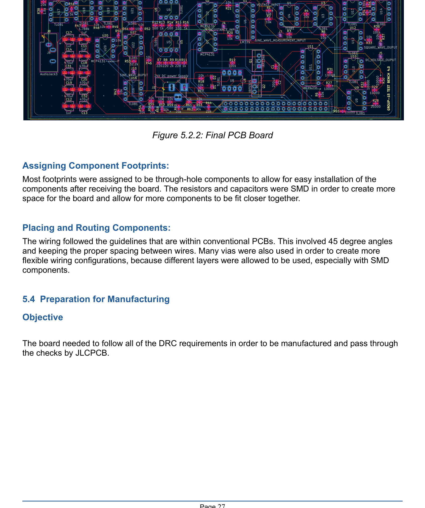

**CAD tool:** KiCad — free, full-featured, low learning curve vs. Altium/Fusion 360.

**Schematic:** Hierarchical sub-sheets for each instrument module; global/hierarchical labels reduce wire clutter. Target: single board ~Raspberry Pi size, **maximum 4 layers** for cost control.

**Layout:** Components grouped by subsystem to minimize signal path length. Mostly through-hole footprints for hand assembly; SMD passives for density. Routing at 45° angles with proper spacing; vias for inter-layer connections.

**Manufacturing:** DRC-checked for JLCPCB; Gerber/drill files included in `PCBDesign/`. Board was designed and quoted but not manufactured for the prototype phase.

---

## GPIO Pin Map (System)

| GPIO | Signal | Component | Description |
|:---:|:---|:---|:---|
| 2, 3 | SDA, SCL | LCD | I²C character display |
| 6 | Input | LM339 | Voltmeter comparator |
| 7 | SPI CS | MCP4231 | Square wave digipot |
| 8 | SPI CS | MCP4131 | Ohmmeter / voltmeter digipot |
| 10 | SPI MOSI | MCP4131/4231 | SPI data |
| 11 | SPI SCLK | MCP4131/4231 | SPI clock |
| 12 | HW PWM | — | Square wave output |
| 13, 19 | Input | KY-040 | Rotary encoder A/B |
| 14, 15, 18, 23, 24 | Output | R-2R ladder | DC reference (5-bit) |
| 17 | SPI CS | MCP4131 | Sine amplitude digipot |
| 21 | Input | LM339 | Ohmmeter comparator |
| 25 | Interrupt | LM339 | Frequency measurement |
| 26 | Input | KY-040 | Encoder button (3 s hold = back) |

---

## Repository Structure

```
MULTIFUNCTION-INSTRUMENTATION-SYSTEM-DAQ-/
├── Main Code/16.py              # Complete firmware
├── Individual Components/         # Per-module KiCad schematics
├── PCBDesign/                     # Full board + Gerbers
├── docs/images/                   # Schematics, photos, scope captures
├── requirements.txt
└── README.md
```

---

## Getting Started

```bash
# Raspberry Pi OS
sudo apt update && sudo apt install -y python3-pip pigpio python3-pigpio alsa-utils
sudo systemctl enable --now pigpio
pip install -r requirements.txt
sudo python3 "Main Code/16.py"
```

| Action | Control |
|---|---|
| Scroll | Rotate encoder |
| Select / confirm | Short press |
| Back / cancel | Hold 3 seconds |
| Edit value | Rotate in edit mode, press to confirm |

Power the Pi via **USB-C** and analog circuits via **24 V DC**. Wait ~20 s after boot for the LCD. Outputs auto-disable when leaving any menu.

---

## Demo Videos

| Feature | Link |
|---|---|
| Power-on & setup | [YouTube](https://youtu.be/CEZYySeiEv4) |
| Menu navigation | [YouTube](https://youtu.be/Nd_8IkFf7bE) |
| Ohmmeter | [YouTube](https://youtu.be/j0UAiwsbkE0) |
| Voltmeter (external) | [YouTube](https://youtube.com/shorts/AqCL2ivuH78) |
| Voltmeter (internal ref) | [YouTube](https://youtube.com/shorts/lTq6MlFrF2s) |
| Square wave | [YouTube](https://youtube.com/shorts/NfCk3m-b2u8) |
| Sine wave | [YouTube](https://youtube.com/shorts/mf1v4rBYL3M) |
| Frequency measurement | [YouTube](https://youtube.com/shorts/Z5qWBG-sBkY) |

---

## Future Improvements

- Upgrade SAR measurement to a dedicated **12–16 bit ADC** (target: mV resolution vs. current ~78 mV/step)
- Manufacture the 4-layer PCB with dedicated ground planes and BNC/screw-terminal I/O
- On-board ±12 V / 3.3 V regulators replacing external rail splitter
- Active shielding on analog inputs to reduce switching noise from power supply

---

## Skills Demonstrated

**Embedded Systems** — GPIO, hardware PWM, SPI/I²C, pigpio edge detection, SAR algorithms, thread-safe concurrent hardware access

**Analog Design** — Op-amp conditioning, comparator front-ends, R-2R DAC, virtual-ground power, MOSFET push-pull stages

**Software Engineering** — State-machine UI, stack navigation, calibrated lookup tables, ~970 LOC integrated firmware

**PCB/CAD** — Hierarchical KiCad schematic, 4-layer layout, Gerber generation

**Systems Integration** — End-to-end HW/SW co-design, shared-resource management, safety interlocks

---

<p align="center"><strong>Developed by Nikhil Mahadevan</strong></p>
