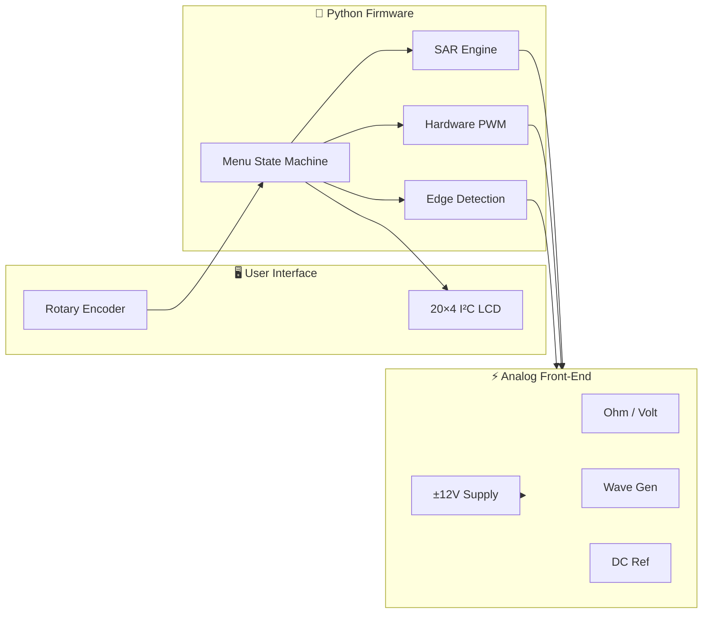
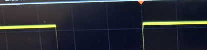
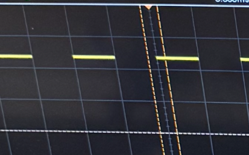
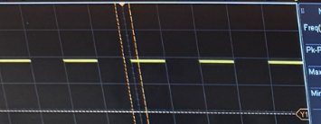

# Multifunction Instrumentation System (M.I.S.)

**Developed by Nikhil Mahadevan**

A portable, Raspberry Pi–powered electronic test bench that replaces six lab instruments — ohmmeter, voltmeter, DC reference, square/sine function generator, and frequency meter — with one integrated DAQ platform.

[](https://www.raspberrypi.com/)
[](https://www.python.org/)
[](https://www.kicad.org/)
[]()
[]()

---

## Table of Contents

- [Overview](#overview)
- [Instrument Summary](#instrument-summary)
- [System Architecture](#system-architecture)
- [Software Architecture](#software-architecture)
- [Hardware Design](#hardware-design)
  - [Power Supply](#41--12-v-power-supply)
  - [Ohmmeter](#42-ohmmeter)
  - [Voltmeter](#43-voltmeter)
  - [DC Reference](#44-dc-reference)
  - [Square Wave Generator](#45-square-wave-generator)
  - [Sine Wave Measurement](#46-sine-wave-measurement-frequency-meter)
  - [Sine Wave Generator](#47-sine-wave-generator)
- [PCB Design](#pcb-design-kicad)
- [GPIO Pin Map](#gpio-pin-map-system)
- [Getting Started](#getting-started)
- [Demo Videos](#demo-videos)
- [Skills Demonstrated](#skills-demonstrated)

---

## Overview

The Multifunction Instrumentation System integrates oscilloscopes, function generators, and multimeters into a single-board computer platform using the **Raspberry Pi 4** as the central processing unit. Custom analog front-end circuits handle signal conditioning, comparison, and generation; Python firmware orchestrates measurement, waveform output, and a responsive menu-driven UI from a single application.


> [!TIP]
> **Documentation convention:** Images show only schematics, photos, and oscilloscope captures. All objectives, theory, and figure captions are written as markdown text below each image.

<details open>
<summary><strong>At a Glance</strong></summary>

| | |
|---|---|
| **Controller** | Raspberry Pi 4 (sole processor — no external MCU) |
| **Interface** | 20×4 I²C LCD + KY-040 rotary encoder with pushbutton |
| **Analog front-end** | TL084/TL081 op-amps, LM339 comparators, MCP4131/MCP4231 digipots |
| **Power** | 24 V DC input → ±12 V virtual-ground split-rail supply |
| **Firmware** | ~970 lines of Python — SAR measurement, hardware PWM, pigpio edge detection |
| **PCB** | 4-layer KiCad hierarchical design with Gerber manufacturing files |

</details>

<details>
<summary><strong>Project Objectives</strong></summary>

1. **Instrument design**
   - Ohmmeter (500 Ω – 10 kΩ)
   - Voltmeter (−5 V to +5 V)
   - DC reference (−5 V to +5 V)
   - Sine wave frequency measurement (1 – 10 kHz)
   - Function generator — square wave (100 Hz – 10 kHz, ±10 V) and sine wave (1 – 10 kHz, 0 – 10 V pk)

2. **System integration**
   - ±12 V power supply from 24 V input
   - Software-driven successive-approximation measurement (digipot + comparator)
   - Rotary-encoder UI on 20×4 LCD

3. **PCB layout**
   - Full KiCad schematic and 4-layer board design sized to the Raspberry Pi footprint

</details>

<details>
<summary><strong>Design Constraints</strong></summary>

| Category | Constraint |
|---|---|
| **Software** | All logic in Python; pigpio daemon for timing-critical PWM and edge detection |
| **Controller** | Raspberry Pi 4 only — no external microcontrollers |
| **Digipots** | Maximum of 4 digital potentiometers (MCP4131 ×3, MCP4231 ×1 dual-channel) |
| **Power** | All analog power derived from 24 V DC (LCD powered separately); Pi via USB-C |
| **Mechanical** | Pi Hat required — all GPIO routed through hat connector |

</details>

---

## Instrument Summary

| Instrument | Range | Accuracy | Update Rate |
|:---|:---|:---|:---|
| 🔵 **Ohmmeter** | 500 Ω – 10 kΩ | ±10% | 500 ms |
| 🟢 **Voltmeter** | −5 V to +5 V | ±0.2 V | 500 ms |
| 🟡 **DC Reference** | −5.00 V to +4.80 V (32 steps) | ±0.2 V | On demand |
| 🟠 **Square Wave** | 100 Hz – 10 kHz, ±10 V pk | ±1 V amplitude | Real-time PWM |
| 🟣 **Sine Wave** | 1 – 10 kHz, 0 – 10 V pk | ±0.2 V amplitude | Real-time audio |
| 🔴 **Frequency Meter** | 1 – 10 kHz | ±1% | 500 ms |

---

## System Architecture



---

## Software Architecture

Software is the core of the system — it links the user interface to hardware modules, converts raw comparator signals into resistance/voltage values, controls waveform timing, and keeps the LCD updated.

<details open>
<summary><strong>Platform & Libraries</strong></summary>

| Layer | Technology |
|---|---|
| OS | Raspberry Pi OS |
| Execution | Standalone Python script (`Main Code/16.py`) |
| GPIO / PWM | `RPi.GPIO`, `pigpio` (hardware PWM + µs edge timestamps) |
| SPI | `spidev` — MCP4131 / MCP4231 digital potentiometers |
| I²C | `smbus2`, `RPLCD` — 20×4 character LCD |
| UI input | `gpiozero` — rotary encoder + button callbacks |

</details>

<details>
<summary><strong>Navigation & Main Loop</strong></summary>

The interface is a **stack-based menu tree** with automatic hardware cleanup on back-navigation. Measurement modes sample every **500 ms**; the LCD refreshes on a 50 ms display flag with thread-safe writes.

```
while True:
    if display_needs_update → render_interface()
    if measurement_mode     → sample hardware every 500 ms
    if leaving_mode         → cleanup GPIO / stop waveforms
    sleep(0.05)
```

</details>

<details>
<summary><strong>Per-Instrument Firmware</strong></summary>

| Instrument | Key Implementation |
|---|---|
| **Square wave** | Hardware PWM GPIO 12 + MCP4231 amplitude/offset over SPI |
| **Sine wave** | Pi audio jack + `speaker-test`; MCP4131 amplitude (CS GPIO 17) |
| **Ohmmeter** | 8-iter SAR on MCP4131; `R = R_known × (step / (128 − step))` |
| **Voltmeter** | SAR on GPIO 6; lookup table + linear interpolation |
| **DC Reference** | 5-bit R-2R on GPIO 14, 15, 18, 23, 24 |
| **Frequency** | pigpio edge callbacks GPIO 25; 100-period buffer, >2σ outlier reject |

</details>

> [!IMPORTANT]
> All waveform and DC outputs **automatically disable** when leaving a menu — a built-in safety interlock.

---

## Hardware Design

### 4.1 ±12 V Power Supply


*Figure 4.1.1: Power Supply Schematic*

<details open>
<summary><strong>Power Supply — Theory & Integration</strong></summary>

**Objective:** Split a +24 V DC input into symmetric +12 V and −12 V rails to power op-amps throughout the system. Rails must remain stable under varying load.

**Theory of Operation:** Virtual ground from a 24 V source. TL081 unity-gain follower at the 12 V midpoint drives IRFZ34N + IRF5305 push-pull stage. Virtual ground tied to Pi GND → +12 V above, −12 V below.

1. **Voltage reference:** Matched 10 kΩ divider + Zener clamping → 12 V at TL081 pin 3
2. **Unity-gain buffering:** 100 kΩ feedback drives MOSFET gates
3. **Push-pull output:** NMOS sources / PMOS sinks load current at virtual ground
4. **Output stabilization:** 220 µF bulk caps per rail

**Physical Integration:** Breadboard; ±12 V via terminal blocks. **GPIO:** None — analog only.

</details>

<details>
<summary><strong>Power Supply — Test Results</strong></summary>

| Test Condition | Negative Rail | Positive Rail | Current |
|---|---|---|---|
| Both loads connected | −12.04 V | +12.05 V | ~12 mA each |
| No load | −12.05 V | +12.06 V | — |
| Negative load only | 12.05 V | — | 12.10 mA |
| Positive load only | — | 12.06 V | 12.08 mA |

</details>

> [!WARNING]
> MOSFETs run warm under heavy load. Observe electrolytic capacitor polarity on each rail.

---

### 4.2 Ohmmeter


*Figure 4.2.1: Ohmmeter Schematic*

<details open>
<summary><strong>Ohmmeter — Theory & GPIO</strong></summary>

**Objective:** High-accuracy auto-ranging digital ohmmeter for **500 Ω to 10 kΩ**.

**Theory of Operation:** Voltage divider with unknown resistor vs. **7-bit MCP4131** programmable reference. Successive approximation across 128 wiper steps; LM339 comparator on GPIO 21. LCD updates every 500 ms with ±10% tolerance.

| Signal | GPIO | Component Pin |
|---|---|---|
| Chip Select (CS) | 8 | MCP4131 Pin 1 |
| SPI Clock (SCK) | 11 | MCP4131 Pin 2 |
| SPI Data (SDI/SDO) | 10 | MCP4131 Pin 3 |
| Comparator Output | 21 | LM339 Output |

</details>

---

### 4.3 Voltmeter


*Figure 4.3.1: Voltmeter Schematic*

<details open>
<summary><strong>Voltmeter — Theory & GPIO</strong></summary>

**Objective:** Measure **−5 V to +5 V** at ±0.2 V accuracy. Dual-source: external input or internal DC reference verification.

**Theory of Operation:**

1. **U2 — Inverting summing amp:** Maps −5 V to +5 V → 0 V to −10 V
2. **U1 — Inverting amp:** Gain −1/3 → **0 to +3.3 V**
3. **U3 — MCP4131:** 128-step programmable reference via SPI
4. **U5A — LM339:** Comparator with 10 kΩ pull-up
5. **GPIO 6:** Binary search until reference matches test voltage

| Signal | GPIO | Component Pin |
|---|---|---|
| Chip Select (CS) | 8 | MCP4131 Pin 1 |
| SPI Clock (SCK) | 11 | MCP4131 Pin 2 |
| SPI Data (SDI/SDO) | 10 | MCP4131 Pin 3 |
| Comparator Output | 6 | LM339 Pin 13 |

**Calibration & Testing:** Verified against reference multimeter across full range. SAR converges in 8 iterations. ±0.2 V accuracy; best precision near 0 V.

</details>

---

### 4.4 DC Reference


*Figure 4.4.1: DC Ref Schematic*

<details open>
<summary><strong>DC Reference — Theory</strong></summary>

**Objective:** Programmable DC output **−5 V to +5 V** in 0.625 V steps (32 levels).

1. **R-2R DAC:** GPIO 14, 15, 18, 23, 24 → binary-weighted divider
2. **U2 — Non-inverting amp:** Gain ≈ 3.03 scales 0–3.3 V → 0–10 V
3. **U3 — Difference amp:** +5 V bias → **−5 V to +5 V** output

**Calibration & Testing:** Output verified across all 32 steps with a reference multimeter. Monotonic response confirmed from −5 V to +5 V.

</details>

<details>
<summary><strong>Previous Design Iteration (Figure 4.4.2)</strong></summary>


*Figure 4.4.2: Previous DC Ref Schematic*

Original binary-weighted DAC with per-GPIO comparator buffers suffered **cross-loading**. R-2R ladder maintains uniform 2R impedance regardless of bit pattern.

</details>

---

### 4.5 Square Wave Generator


*Figure 4.5.1: Square Wave Schematic*

<details open>
<summary><strong>Square Wave — Theory & GPIO</strong></summary>

**Objective:** Variable square wave centered at **0 V**, up to **±10 V**, high-Z output for oscilloscope use.

**Theory:** Pi hardware PWM GPIO 12 → MCP4231 amplitude + offset → difference amplifier (gain 10) → ±10 V.

| Signal | GPIO | MCP4231 Pin |
|---|---|---|
| PWM Output | 12 | Ch1 Pin B |
| Chip Select | 7 | Pin 1 |
| SPI Clock | 11 | Pin 3 |
| SPI Data In | 10 | Pin 4 |

**Calibration & Testing:**

- **Figure 4.5.2 — ±7 V initial:** −7.24 V min / +5.95 V max (miscentered)
- **Figure 4.5.3 — ±5 V @ 100 Hz:** Offset ratio **0.45** → ±3% centering
- **Figure 4.5.4 — ±10 V @ 100 Hz:** Full swing confirmed

</details>

<details>
<summary><strong>Oscilloscope Captures</strong></summary>







</details>

---

### 4.6 Sine Wave Measurement (Frequency Meter)


*Figure 4.6.1: Sine Wave Measurement Schematic*

<details open>
<summary><strong>Frequency Meter — Theory & GPIO</strong></summary>

**Objective:** Measure **0 V to +10 V** sine input frequency from **1 kHz to 10 kHz**.

**Theory:** LM339 threshold at **+1.65 V** → digital edges on GPIO 25 → **f = 1/T**. 100-period rolling buffer with >2σ outlier rejection.

| Signal | GPIO | Component Pin |
|---|---|---|
| Comparator Output | 25 | LM339 Output |
| External Input | — | LM339 Non-Inverting Input |
| Reference (+1.65 V) | — | LM339 Inverting Input |

**Calibration & Testing:** ±2% tolerance across 1 – 10 kHz.

</details>

---

### 4.7 Sine Wave Generator


<details open>
<summary><strong>Sine Wave Generator — Theory & GPIO</strong></summary>

**Objective:** **0 – 10 V peak** sine wave from **1 kHz to 10 kHz**.

1. **U3 — TL081 buffer:** Pi audio jack + −5 V DC offset
2. **U4 & U5 — Scaling:** Normalize to 0–3.3 V
3. **U10 — MCP4131:** Digital attenuation via SPI
4. **U11 & U12 — Output:** Reconstruct to 0–10 V

| Signal | GPIO | MCP4131 Pin |
|---|---|---|
| Chip Select | 17 | Pin 1 |
| SPI Clock | 11 | Pin 2 |
| SPI Data | 10 | Pin 3 |

</details>

---

## PCB Design (KiCad)


*Figure 5.2.1: Final PCB Schematic*


*Figure 5.2.2: Final PCB Board*

<details>
<summary><strong>PCB Design Details</strong></summary>

- **CAD tool:** KiCad — free, full-featured
- **Schematic:** Hierarchical sub-sheets per instrument; max 4 layers
- **Layout:** Subsystem grouping, through-hole + SMD passives, 45° routing
- **Manufacturing:** DRC-checked Gerbers in `PCBDesign/` (designed, not manufactured)

</details>

---

## GPIO Pin Map (System)

<details open>
<summary><strong>Full GPIO Map — click to expand</strong></summary>

| GPIO | Signal | Component | Description |
|:---:|:---|:---|:---|
| 2, 3 | SDA, SCL | LCD | I²C character display |
| 6 | Input | LM339 | Voltmeter comparator |
| 7 | SPI CS | MCP4231 | Square wave digipot |
| 8 | SPI CS | MCP4131 | Ohmmeter / voltmeter digipot |
| 10 | SPI MOSI | MCP4131/4231 | SPI data |
| 11 | SPI SCLK | MCP4131/4231 | SPI clock |
| 12 | HW PWM | — | Square wave output |
| 13, 19 | Input | KY-040 | Rotary encoder A/B |
| 14, 15, 18, 23, 24 | Output | R-2R ladder | DC reference (5-bit) |
| 17 | SPI CS | MCP4131 | Sine amplitude digipot |
| 21 | Input | LM339 | Ohmmeter comparator |
| 25 | Interrupt | LM339 | Frequency measurement |
| 26 | Input | KY-040 | Encoder button (3 s hold = back) |

</details>

---

## Getting Started

> [!NOTE]
> GPIO access requires `sudo`. The `pigpio` daemon must be running for PWM and frequency measurement.

<details open>
<summary><strong>Install & Run</strong></summary>

```bash
sudo apt update && sudo apt install -y python3-pip pigpio python3-pigpio alsa-utils
sudo systemctl enable --now pigpio
pip install -r requirements.txt
sudo python3 "Main Code/16.py"
```

</details>

<details>
<summary><strong>Controls Cheat Sheet</strong></summary>

| Action | Control |
|---|---|
| Scroll | Rotate encoder |
| Select / confirm | Short press |
| Back / cancel | Hold 3 seconds |
| Edit value | Rotate in edit mode, press to confirm |

Power Pi via **USB-C**, analog circuits via **24 V DC**. Wait ~20 s after boot.

</details>

---

## Demo Videos

<details open>
<summary><strong>Watch demos — click any link</strong></summary>

| Feature | Link |
|---|---|
| Power-on & setup | [YouTube](https://youtu.be/CEZYySeiEv4) |
| Menu navigation | [YouTube](https://youtu.be/Nd_8IkFf7bE) |
| Ohmmeter | [YouTube](https://youtu.be/j0UAiwsbkE0) |
| Voltmeter (external) | [YouTube](https://youtube.com/shorts/AqCL2ivuH78) |
| Voltmeter (internal ref) | [YouTube](https://youtube.com/shorts/lTq6MlFrF2s) |
| Square wave | [YouTube](https://youtube.com/shorts/NfCk3m-b2u8) |
| Sine wave | [YouTube](https://youtube.com/shorts/mf1v4rBYL3M) |
| Frequency measurement | [YouTube](https://youtube.com/shorts/Z5qWBG-sBkY) |

</details>

---

## Future Improvements

> [!TIP]
> Planned next steps: 12–16 bit external ADC, manufactured 4-layer PCB with ground planes, BNC/screw-terminal I/O, on-board regulators, active analog shielding.

---

## Skills Demonstrated

<table>
<tr>
<td width="50%">

**Embedded Systems**
- GPIO, hardware PWM, SPI/I²C
- pigpio edge detection
- SAR algorithms
- Thread-safe concurrent access

**Software Engineering**
- State-machine UI
- Stack navigation
- Lookup tables
- ~970 LOC firmware

</td>
<td width="50%">

**Analog Design**
- Op-amp conditioning
- Comparator front-ends
- R-2R DAC
- Virtual-ground power

**PCB / Systems**
- KiCad hierarchical design
- 4-layer layout
- End-to-end HW/SW co-design
- Safety interlocks

</td>
</tr>
</table>

---

<p align="center">
  
</p>
