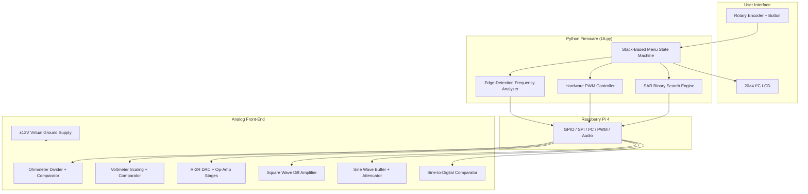
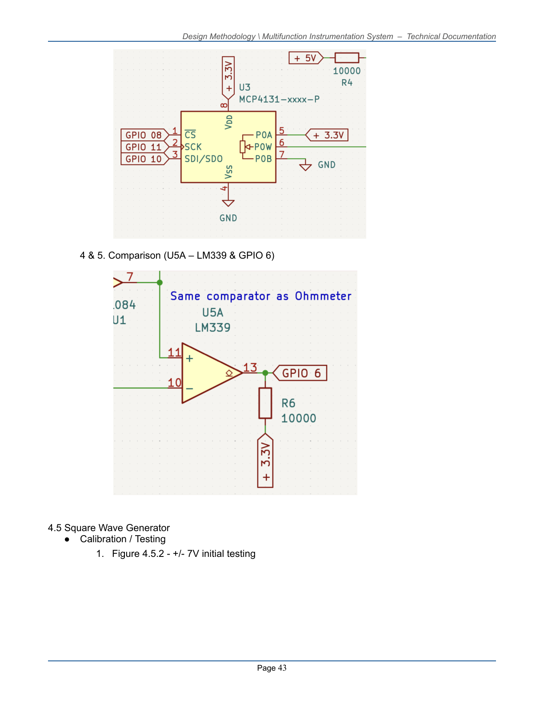
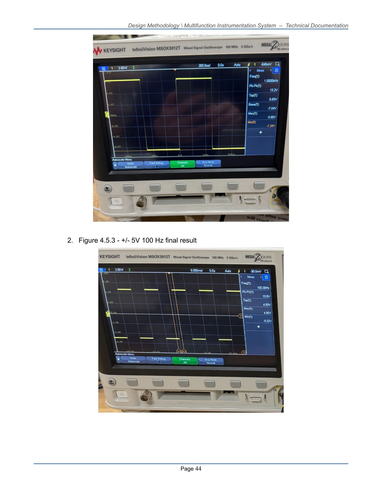

# Multifunction Instrumentation System (M.I.S.)

**A portable, Raspberry Pi–powered electronic test bench that replaces six lab instruments with one integrated DAQ platform.**

[](https://www.uga.edu/)
[](https://www.raspberrypi.com/)
[](https://www.python.org/)
[](https://www.kicad.org/)

> **University of Georgia · College of Electrical and Computer Engineering · Design Methodology (ECSE 2920)**  
> Team: Zeke Beckford · Jessica Cruz · **Nikhil Mahadevan** · Ben Parks · Shruthi Raj

---

## At a Glance

| | |
|---|---|
| **What it is** | A single-board DAQ system that combines oscilloscope, function generator, multimeter, and DC reference capabilities |
| **Controller** | Raspberry Pi 4 (sole processor — no external MCU) |
| **Interface** | 20×4 I²C LCD + rotary encoder with pushbutton |
| **Analog front-end** | TL084/TL081 op-amps, LM339 comparators, MCP4131/MCP4231 digital potentiometers |
| **Power architecture** | 24 V DC input → ±12 V virtual-ground split-rail supply |
| **Software** | ~970 lines of modular Python with SPI-driven SAR measurement, hardware PWM, and pigpio edge detection |
| **PCB** | 4-layer KiCad design (schematic + layout included; manufacturing-ready) |

---

## The Problem & Our Solution

Traditional electronics lab work requires separate, expensive bench instruments — oscilloscopes, function generators, multimeters, and DC sources — each with its own footprint, power requirements, and learning curve.

**M.I.S. consolidates six instruments into one portable test bench** controlled by a Raspberry Pi 4. Custom analog front-end circuits handle signal conditioning, comparison, and generation, while Python firmware orchestrates measurement, waveform output, and a responsive menu-driven UI — all from a single application.


---

## Instrument Capabilities

| Instrument | Range | Resolution / Steps | Accuracy | Method |
|---|---|---|---|---|
| **Ohmmeter** | 500 Ω – 10 kΩ | 128 wiper steps | ±10% | Successive approximation via MCP4131 + LM339 comparator |
| **Voltmeter** | −5 V to +5 V | ~78 mV/step | ±0.2 V | 8-iteration binary search + calibrated lookup table |
| **DC Reference** | −5.00 V to +5.00 V | 32 steps (0.625 V) | ±0.2 V | 5-bit R-2R ladder + dual op-amp scaling |
| **Square Wave Generator** | 100 Hz – 10 kHz, ±10 V pk | 10/100 Hz step | ±1 V amplitude | Hardware PWM (pigpio) + MCP4231 amplitude/offset control |
| **Sine Wave Generator** | 1 – 10 kHz, 0 – 10 V pk | 500 Hz / 124 amp steps | ±0.2 V | Pi audio jack + MCP4131 attenuation chain |
| **Frequency Measurement** | 1 – 10 kHz | 100-sample rolling buffer | ±1% | LM339 threshold comparator + pigpio microsecond edge timestamps |

---

## System Architecture



### Software Design Highlights

- **Modular single-application architecture** — one Python script manages all six instruments through a unified menu tree
- **Stack-based navigation** with automatic hardware cleanup when switching modes or navigating back
- **Asynchronous input handling** — rotary encoder callbacks (`gpiozero`) keep the UI responsive during live measurements
- **Thread-safe LCD writes** protected by a lock to prevent display corruption
- **Successive approximation (SAR) engine** — 8-iteration binary search across MCP4131 wiper positions for resistance and voltage measurement
- **Statistical outlier rejection** — frequency measurement discards periods >2σ from the mean before averaging
- **Safety-first output management** — all waveform and DC outputs automatically disable when leaving a menu

### Main Control Loop

```
while True:
    if display_needs_update → render_interface()     # 50 ms poll
    if measurement_mode   → sample every 500 ms      # live readings
    if leaving_mode       → cleanup GPIO / stop PWM  # safe state
    sleep(0.05)
```

---

## Hardware Design

### Power Supply — ±12 V Virtual Ground

A 24 V DC input is split into symmetric ±12 V rails using a TL081 unity-gain buffer driving an IRFZ34N / IRF5305 complementary MOSFET push-pull stage. A resistive divider with Zener clamping establishes the 12 V midpoint reference. Verified under load: **−12.04 V / +12.05 V at 12 mA per rail**.


### Measurement Subsystems

**Ohmmeter** — Unknown resistance forms a voltage divider with a 10 kΩ reference. An MCP4131 digital potentiometer sweeps the comparison voltage while an LM339 comparator provides binary feedback to GPIO 21. Resistance is calculated as:

```
R_unknown = R_known × (step / (128 − step))
```


**Voltmeter** — Two-stage TL084 inverting amplifier chain scales −5 V to +5 V inputs down to 0–3.3 V logic range. An MCP4131 generates the comparison reference; results are mapped through a pre-characterized 128-point lookup table with linear interpolation.


### Signal Generation

**Square Wave** — Raspberry Pi hardware PWM on GPIO 12 produces the base waveform. An MCP4231 dual digipot independently controls amplitude and DC offset before a difference amplifier centers the output at 0 V with ±10 V swing.


<p align="center">
  
  
</p>

**Sine Wave** — The Pi 3.5 mm audio jack drives a multi-stage op-amp chain: impedance buffer → scaling/normalization → MCP4131 digital attenuation → output reconstruction to 0–10 V pk.


**Frequency Measurement** — External sine input is compared against a +1.65 V threshold by an LM339. Rising edges on GPIO 25 are timestamped by pigpio with microsecond precision; frequency = 1 / mean(filtered period).


### DC Reference — 5-Bit R-2R DAC

Five GPIO pins drive an R-2R resistor ladder, producing 32 discrete output steps from −5.00 V to +4.80 V. Two TL084 stages scale and offset the ladder output to the target ±5 V range.


---

## GPIO Pin Map

| GPIO | Signal | Component | Description |
|:---:|:---|:---|:---|
| 2, 3 | SDA, SCL | LCD | I²C character display interface |
| 6 | Input | LM339 | Voltmeter comparator output |
| 8 | SPI CS | MCP4131 | Ohmmeter / voltmeter digipot chip select |
| 10 | SPI MOSI | MCP4131 | SPI data |
| 11 | SPI SCLK | MCP4131 | SPI clock |
| 12 | HW PWM | — | Square wave generation |
| 13, 19 | Input | KY-040 | Rotary encoder A/B (internal pull-up) |
| 14, 15, 18, 23, 24 | Output | R-2R Ladder | 5-bit DC reference control |
| 17 | SPI CS | MCP4131 | Sine wave amplitude digipot |
| 21 | Input | LM339 | Ohmmeter comparator output |
| 25 | Interrupt | LM339 | Frequency measurement edge detection |
| 26 | Input | KY-040 | Encoder pushbutton (3 s hold = back) |

---

## Repository Structure

```
MULTIFUNCTION-INSTRUMENTATION-SYSTEM-DAQ-/
├── Main Code/
│   └── 16.py                          # Complete firmware — UI, measurements, waveforms
├── Individual Components/
│   ├── 1 - Power Supply/              # ±12V split-rail schematic
│   ├── 2 - Ohmmeter/                  # Resistance measurement circuit
│   ├── 3 - Voltmeter/                 # Voltage scaling + comparison circuit
│   ├── 4 - DC Ref/                    # R-2R DAC reference source
│   ├── 5 - Square Wave/               # PWM square wave generator
│   └── 7 - Sine Wave Generator/       # Audio-driven sine wave chain
├── PCBDesign/
│   ├── PCBDesign.kicad_sch            # Hierarchical master schematic
│   ├── PCBDesign.kicad_pcb            # 4-layer PCB layout
│   └── *.gbr / *.drl                  # Gerber manufacturing files
├── docs/images/                       # Schematics, photos, and test captures
├── requirements.txt                   # Python dependencies
└── README.md
```

### PCB Design (KiCad)

The team designed a **4-layer hierarchical PCB** sized to match the Raspberry Pi footprint. The schematic uses modular sub-sheets for each instrument, and the layout follows standard routing conventions (45° traces, dedicated ground planes, SMD passives for density).

<p align="center">
  
  
</p>

---

## Getting Started

### Hardware Requirements

- Raspberry Pi 4 with Pi Hat / GPIO breakout
- 24 V DC power supply (analog circuits)
- USB-C power supply (Raspberry Pi only)
- 20×4 I²C LCD (PCF8574 backpack)
- KY-040 rotary encoder
- MCP4131 / MCP4231 digital potentiometers
- TL084 / TL081 op-amps, LM339 comparators
- Breadboard or manufactured PCB

### Software Setup

```bash
# On Raspberry Pi OS
sudo apt update
sudo apt install -y python3-pip pigpio python3-pigpio alsa-utils

# Enable and start pigpio daemon (required for PWM and edge detection)
sudo systemctl enable pigpio
sudo systemctl start pigpio

# Install Python dependencies
pip install -r requirements.txt

# Run the test bench firmware
sudo python3 "Main Code/16.py"
```

> **Note:** GPIO access requires root privileges on Raspberry Pi OS. The `pigpio` daemon must be running before launch for square wave generation and frequency measurement.

### Quick Operation Guide

| Action | Control |
|---|---|
| Scroll menu | Rotate encoder clockwise / counter-clockwise |
| Select / confirm | Short press encoder button |
| Go back / cancel | Hold encoder button for 3 seconds |
| Adjust value (edit mode) | Rotate encoder, then press to confirm |

After boot (~20 s), the LCD shows **OFF** and **Mode Select**. Choose **Mode Select** to access all six instruments. Outputs automatically turn off when leaving any menu — a built-in safety feature.

---

## Demo Videos

| Feature | Video |
|---|---|
| System power-on & setup | [YouTube](https://youtu.be/CEZYySeiEv4) |
| Menu navigation | [YouTube](https://youtu.be/Nd_8IkFf7bE) |
| Ohmmeter live measurement | [YouTube](https://youtu.be/j0UAiwsbkE0) |
| Voltmeter (external) | [YouTube](https://youtube.com/shorts/AqCL2ivuH78) |
| Voltmeter (internal ref) | [YouTube](https://youtube.com/shorts/lTq6MlFrF2s) |
| Square wave generator | [YouTube](https://youtube.com/shorts/NfCk3m-b2u8) |
| Sine wave generator | [YouTube](https://youtube.com/shorts/mf1v4rBYL3M) |
| Frequency measurement | [YouTube](https://youtube.com/shorts/Z5qWBG-sBkY) |

---

## Design Constraints & Engineering Decisions

| Constraint | Our Approach |
|---|---|
| Python-only firmware | Modular architecture with hardware abstraction via `RPi.GPIO`, `spidev`, and `pigpio` |
| Pi 4 as sole controller | All timing-critical tasks use hardware PWM and pigpio callbacks instead of software loops |
| Max 4 digital potentiometers | MCP4131 (×3) + MCP4231 (×1 dual-channel) shared across instruments via SPI chip selects |
| 24 V sole power source (except LCD) | Custom ±12 V virtual-ground split rail; Pi powered independently via USB-C |
| Pi Hat required | All GPIO, power, and ground routed through the Pi Hat connector |

### Notable Design Iterations

- **DC Reference:** Migrated from binary-weighted resistor DAC to R-2R ladder to eliminate cross-loading between GPIO-driven nodes
- **Sine Generator:** Added U3 voltage follower to eliminate frequency-dependent amplitude sag from the Pi audio jack
- **Square Wave:** Introduced buffer amplifiers on difference-amplifier inputs; calibrated offset ratio to 0.45 (from ideal 0.5) to account for MCP4231 channel variation
- **Power Supply:** Switched from 200 µF ceramic to 220 µF electrolytic bulk capacitors for improved rail stability under switching loads

---

## Skills Demonstrated

**Embedded Systems**
- Real-time GPIO management, hardware PWM, SPI/I²C bus communication
- Microsecond-precision edge detection with statistical signal filtering
- Successive approximation ADC algorithms in software

**Analog Circuit Design**
- Op-amp signal conditioning (inverting/summing/difference amplifiers)
- Comparator-based measurement front-ends
- R-2R DAC design, virtual-ground power architecture, MOSFET push-pull output stages

**Software Engineering**
- State machine UI design with stack-based navigation
- Thread-safe concurrent hardware access
- Calibrated lookup tables with linear interpolation
- Modular, single-file firmware architecture (~970 LOC)

**PCB & CAD**
- Hierarchical KiCad schematic design
- 4-layer PCB layout with DRC-compliant routing
- Gerber file generation for JLCPCB manufacturing

**Systems Integration**
- End-to-end hardware–software co-design
- Cross-instrument resource sharing (GPIO multiplexing, shared comparators)
- Safety interlocks and automatic output shutdown

---

## Future Improvements

- Upgrade measurement resolution from 7-bit digipot SAR to a dedicated 12–16 bit external ADC (target: mV-level precision)
- Transition from breadboard prototype to manufactured 4-layer PCB with dedicated ground planes
- Add BNC connectors for signal I/O and robust screw terminals for power
- Implement active shielding on analog input lines to reduce switching noise
- Add hardware protection (fuses, isolation) for commercial deployment

---

## Documentation

Full technical documentation and user manual are available in the project deliverables:

- **Technical Documentation** — Complete hardware theory, software design, calibration data, and appendix figures
- **User Manual** — Step-by-step operating instructions, safety warnings, and troubleshooting guide

---

## License

This project was developed as coursework for ECSE 2920 at the University of Georgia. All design schematics, source code, and PCB layouts are original work by Group 15.

---

<p align="center">
  <strong>Built by Group 15 · University of Georgia · ECSE 2920 Design Methodology · Spring 2026</strong>
</p>
